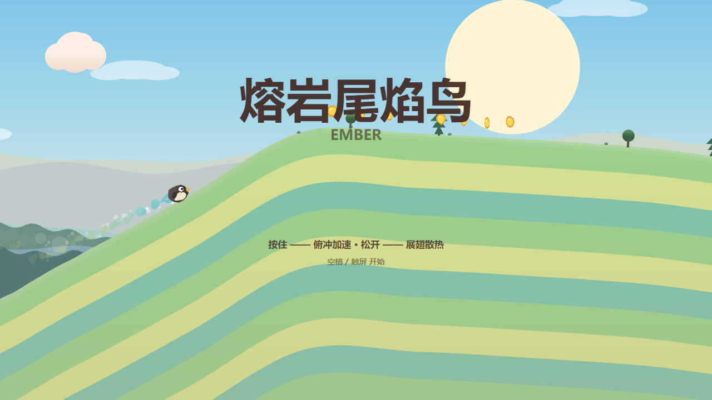
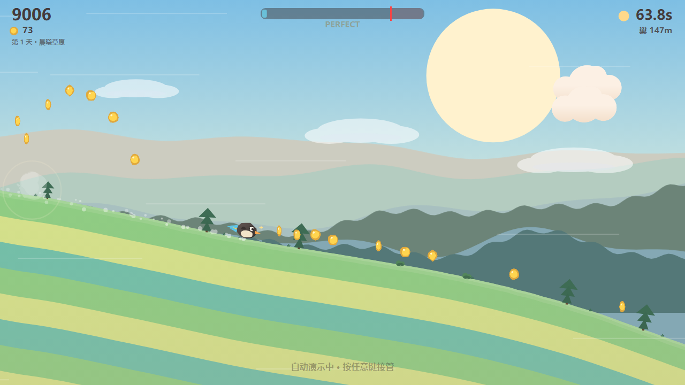
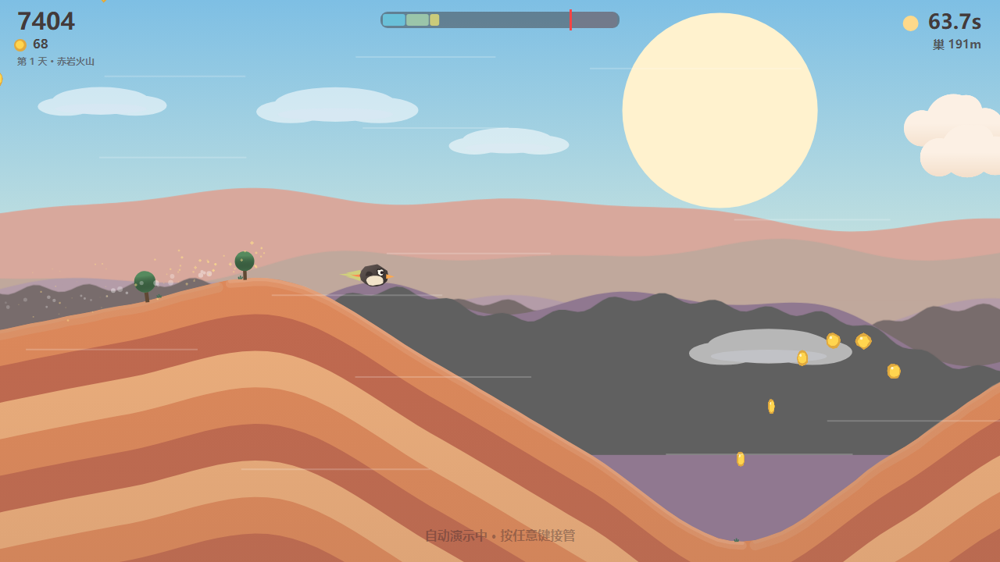

# 熔岩尾焰鸟 · Ember

> 一只翅膀太小飞不起来的火山鸟，靠**按住压坡加速、松手展翅散热**，在日落前赶回巢穴。
> 单键节奏滑行游戏 —— 「贪速度」与「保命」的博弈。

[](LICENSE)
[](https://vitejs.dev)
[](https://www.typescriptlang.org)


**技术栈**：Vite 5 + TypeScript 5 + 原生 Canvas 2D。**零第三方运行时依赖、零外部素材**——所有图形由 Canvas 绘制（手绘绘本插画风，Tiny Wings 式轮廓条纹山丘），全部音效/音乐由 WebAudio 程序化合成，地形种子化随机生成。构建产物约 75KB，断网双击即玩。

| | | |
|---|---|---|
|  |  |  |
| 标题画面 | 第 1 天 · 晨曦草原 | 第 5 天 · 赤岩火山 |

**[▶ 在线试玩（GitHub Pages）](https://cnwinds.github.io/ember/)**

---

## 目录

- [快速开始](#快速开始)
- [玩法](#玩法)
- [关卡与主题](#关卡与主题)
- [核心系统](#核心系统)
- [架构](#架构)
- [调参指南](#调参指南)
- [验证方式](#验证方式)
- [许可证](#许可证)

## 快速开始

```bash
npm install
npm run dev        # http://localhost:5173 直接进入成品体验
npm test           # 53 项测试（回放确定性 / 物理 / 热度 / 判定 / 难度曲线）
npm run build      # 产物 dist/ 纯静态（base './'），断网双击 index.html 可玩
```

## 玩法

**单键**（空格 / ↓ / 触屏），完全复刻 Tiny Wings 的压坡操控：

- **按住 = 压坡**：重力 ×3.0。下坡强加速（吃势能）、上坡强减速（所以上坡要松手）、空中快速下压
- **松开 = 对称抛物线**：恒定 1× 重力，无襟翼、无推力——飞行高度 100% 来自坡道动能转换
- **唇沿弹射**：陡爬升中带速离地 → 方向转换到弹射角（最高 42°），**顶点高度 ∝ 速度的平方**
- **上坡保底 420px/s**：按住爬坡永不失速（失速退化为慢爬），「卡在山坳」在数学上不可能

环绕它的是**热度系统**——贪速的红线：

- 积热按速度分段计价：攒速便宜（+4/s）、满速昂贵（+16/s）——爆燃只惩罚贪婪，不惩罚勤奋
- 红热（80+）：速度上限 +10%、**分数 ×1.5**、金币磁吸 ×1.5——危险与荣华并存
- 爆燃（100）：原地爆炸 3s 惩罚（无全屏旋转、不死亡），凤凰复燃于下一坡顶
- 高速滑翔 = 风阻冷却（最高 -24/s）：**大飞行本身就是散热器，爽点即冷却**
- 完美着陆（角度差 <15°）：combo+1、涡轮冷却 -20、2 帧 hit-stop——3 连完美进 Fever

飞得越高天越暗、云在脚下、星星亮起——六层高度境界：**山麓 → 低云 → 云海 → 平流层 → 中间层 → 外太空**。

## 关卡与主题

**难度曲线**（第 1 天 → 第 8 天）：由地形按里程确定性推导。

| | 第 1 天 | 第 8 天+ |
|---|---|---|
| 定位 | 连飞天堂：容易连续快速连飞 | 速度荒漠：处处被阻断 |
| 云霄发射台密度 | 45% | 15% |
| 上坡减速带 | 8%（矮） | 40%（且更陡） |
| 岩石摩擦区 | 0% | 19.6% |

**每关一个名字、一套画风**（过关时平滑渐变）：

| 关 | 主题 | 关 | 主题 |
|---|---|---|---|
| 1 | 晨曦草原 | 5 | 赤岩火山 |
| 2 | 金穗丘陵 | 6 | 薄暮紫原 |
| 3 | 珊瑚沙谷 | 7 | 极夜冰原 |
| 4 | 翠风峡湾 | 8 | 星海之巅 |

## 核心系统

- **120Hz 固定时间步 + 渲染插值**——不同刷新率手感一致；慢放只改时间换算，绝不改步长
- **种子化地形**：同种子完全复现（每日挑战 `?daily`）；惰性生成、与查询顺序无关
- **云霄发射台**：长直下坡 → 谷底 → 陡峭唇沿的专属山坳，金币沿发射轨迹引导
- **全局下行趋势**（Tiny Wings 岛屿式）：任何失速都会被地形带着往前流
- **手绘绘本渲染**：柔和渐变天空与太阳光晕、Tiny Wings 式三色轮廓条纹山丘、全程无描边、四层大气透视远山剪影 + 树线、植被/里程路牌
- **程序化音频**：速度联动风声、红热心跳、完美琶音、Fever 升半调 BGM——零音频文件
- **自适应性能**：<55fps 自动降粒子密度与视差层数；60fps 余量充足
- **可录制回放**：输入序列 RLE 记录，`F2` 导出 / `F3` 重放，回放逐帧确定性

## 架构

```
src/
  core/     基础设施：loop(固定步) / input(单键+录制) / rng(确定性) / constants(数值表) / mathutil
  sim/      纯确定性模拟（零 DOM 引用，状态 = f(seed, 输入序列)）
            terrain(种子化地形+难度曲线) / heat(热度) / game(物理+判定+关卡) / replay
  render/   视觉：palette(昼夜+主题) / particles(统一池) / parallax(四层+树线)
            terrainRender(地形+植被+路牌) / birdRender / hud / screenfx / camera / renderer
  audio/    synth(WebAudio 音效) / bgm(程序化音乐)
  app.ts    场景流（标题/游玩/结算/霞光演出）
tests/      53 项 vitest：回放确定性、物理、热度分段、完美判定、Combo-Fever 链、难度递进
scripts/    手感基准（读坡策略 bot 量化空中占比/飞行高度/速度）
```

**为何零引擎**：本作手感三要素（压坡、穿透投影贴合、热度节奏）都要求逐帧可控的积分与约束，现成物理引擎反而碍事；视觉是绘本插画 + 粒子池，Canvas 2D 绰绰有余。

## 调参指南

所有数值集中在 [`src/core/constants.ts`](src/core/constants.ts)（唯一来源）：

| 想调 | 改这里 |
|---|---|
| 飞得更高/更低 | `G`（1280）、`BASE_MAX_SPEED`（2800）、唇沿弹射角（game.ts 的 `0.73`） |
| 提速更慢/更快 | `PRESS_G_MULT`（3.0）、`SOFT_CAP_RATE`（1.1） |
| 热度经济 | `HEAT` 块（分段速率、红热福利、爆燃阈值） |
| 关卡难度曲线 | `terrain.ts` 的 `difficultyAt` 与特征桶比例 |
| 关卡主题 | `palette.ts` 的 `THEMES` |
| 镜头 | `camera.ts`（高空取景跨度预算 `0.3 * vh`） |

调试：`F1` 调试面板 · `F2` 导出回放 · `F3` 重放 · `?demo` 自动演示（任意键接管）· `?debug` · `?theme=N` 预览关卡画风 · `?daily` 每日挑战

## 验证方式

- **回放确定性**：同种子同输入两次运行逐采样点全等；输入偏移 1 步即发散；JSON 往返一致
- **判定实测**：着陆/Combo/Fever/爆燃/难度曲线全部构造场景 + 40s 节奏局实测，不用「代码看着对」代替
- **卡坡零容忍**：6 种子 × 最优/迟钝时机 × 40s = 零卡死；上坡保底专项测试
- **离线**：产物零外部 URL（`grep` 验证）

## 致谢

灵感来自 Andreas Illiger 的《Tiny Wings》与 Alto's Odyssey 的色彩层次——向经典致敬，所有代码与资产原创。

## 许可证

[MIT](LICENSE) © 2026 cnwinds
